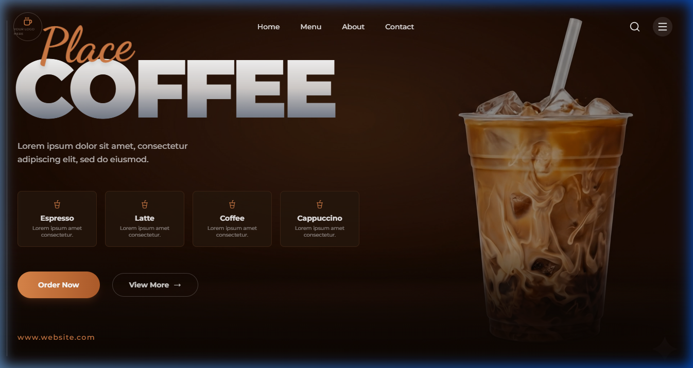

<div align="center">
  
  <br/>
  <h1>Place Coffee</h1>
  <p>A premium, modern web experience for a high-end coffee shop.</p>
</div>

---

## ☕ About The Project

**Place Coffee** is a beautifully designed, responsive web application that brings the premium coffee shop experience to your screen. 

### ✨ Key Features
- **Immersive Hero Section**: Features a stunning full-screen looping video background that immediately captures attention.
- **Dynamic Typography**: Custom script fonts and massive, dynamically scaling headers create a bold, modern aesthetic.
- **Continuous Marquee Menu**: A sleek, auto-scrolling horizontal carousel built with Swiper.js to elegantly display our signature drinks (Cold Brew, Iced Matcha, Lattes, and more).
- **Fully Responsive Design**: Carefully crafted with Tailwind CSS to look flawless on any device—from large desktop monitors down to the narrowest mobile screens.

## 🚀 Run Locally

**Prerequisites:** Node.js

1. Install dependencies:
   ```bash
   npm install
   ```
2. Run the development server:
   ```bash
   npm run dev
   ```
3. Open your browser and visit `http://localhost:3000` to view the app!

## 📸 Adding Your Screenshot
*Note: To display the screenshot at the top of this README on GitHub, please save your screenshot image as `screenshot.png` inside the `public` folder of this project!*
